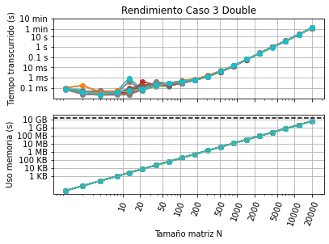
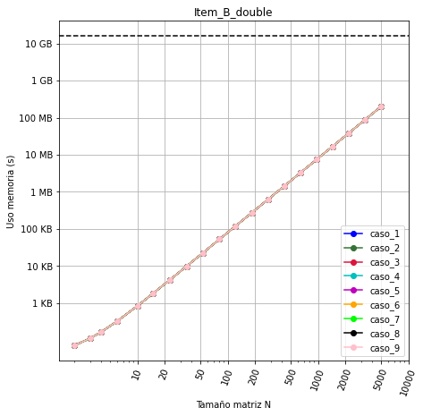

# MCOC2021-P0

# Mi computador principal

* Marca/modelo: 
* Tipo: Desktop
* Año adquisición: 2021
* Procesador:
  * Marca/Modelo: Intel Core i5-10400F
  * Velocidad Base: 2.9 GHz
  * Velocidad Máxima: 4.30 GHz
  * Numero de núcleos: 6 
  * Humero de hilos: 12
  * Arquitectura: x86_64
  * Set de instrucciones: Intel SSE4.1, Intel SSE4.2, Intel AVX2
* Tamaño de las cachés del procesador
  * L1d: 384KB
  * L1i: 384KB
  * L2: 1536KB
  * L3: 12288KB
* Memoria 
  * Total: 16 GB
  * Tipo memoria: DDR4
  * Velocidad 3200 MHz
  * Numero de (SO)DIMM: 2
* Tarjeta Gráfica
  * Marca / Modelo: Nvidia GeForce GTX 1660s
  * Memoria dedicada: 5991 MB
  * Resolución: 1920 x 1080
* Disco 1: 
  * Marca: Western Digital
  * Tipo: SSD
  * Tamaño: 0.5TB
  * Particiones: 3
  * Sistema de archivos: NTFS

  
* Dirección MAC de la tarjeta wifi: 18:C0:4D:4B:FB:A7 
* Dirección IP (Interna, del router): 192.168.0.15
* Dirección IP (Externa, del ISP): 190.162.228.140
* Proveedor internet: VTR Banda Ancha S.A.

##### DESEMPEÑO MATMUL #####

1) ¿Cómo difiere del gráfico del profesor/ayudante?

R: Este difiere en los valores particulares de cuanto tarda o cuanta memoria usa para cada corrida en particular. Sin embargo, el comportamiento general del grafico
es el mismo. Con respecto a lo anterior, se puede ver como tiene la misma volatilidad en al zona intermedia para el tiempo. Para la memoria es la misma grafica lineal
con valores particulares distintos.

2) ¿A qué se pueden deber las diferencias en cada corrida?

R: En el caso del tiempo, las diferencias se deben a los procesos que se estan llevando a cabo en la maquina. El sistema operativo (multi-tasking en este caso), maneja los distintos recursos virtualizandolos y repartiendolos dentro de una cola para cada proceso/programa corriendo en concurrencia (Scheduled Tasks in a Time-Sharing OS). El estado de esta cola es dinamico, por lo que el tiempo en que corre cada programa puede variar por la diferencia de los recursos disponibles y estado de la cola para hacer el "Time-Sharing". Cabe mencionar, que la zona volatil del grafico se debe a los cambios de memoria dependiendo de la jerarquia, por lo que el sistema operativo al ir variando esta, genera algun tipo de volatilidad y mayor tiempo de ejecución.

3) El gráfico de uso de memoria es lineal con el tamaño de matriz, pero el de tiempo transcurrido no lo es ¿porqué puede ser?

R: Esto se debe a la naturaleza del algoritmo. Cada algoritmo tiene una complejidad para la memoria y tiempo, en este caso, matmul simplemente reserva memoria para 3 matrices (cada matriz es una reserva lineal O(N)) por lo que la complejidad para la memoria es O(3N) == O(N). En el tiempo el algoritmo se comporta de forma potencial, ya que la naturaleza de multiplicar matrices implica un ciclo dentro de otro por lo que se comporta potencialmente para el tiempo (probablemente O(N**2)).

4) ¿Qué versión de python está usando?

R: 3.8.5

5) ¿Qué versión de numpy está usando?

R: 1.19.2

6) Durante la ejecución de su código ¿se utiliza más de un procesador? Muestre una imagen (screenshot) de su uso de procesador durante alguna corrida para confirmar. 

R: Durante la ejecución se utilizan los 6 nucleos y 12 threads disponibles (12 procesos). Esto es gracias a la paralelización que facilita numpy.

##### DESEMPEÑO INV #####

1) Comentarios y observaciones:

R: La función inv de numpy no trabaja con float16 y float128, estos tipos de datos no los acepta y por ende no se generaron resultados para esos casos. Cabe mencionar que en los demas casos al trabajar con float128 por lo general este se cambia a float64 ya que python esta codificadao en 64 bits y cualquier valor superior es tomado como si fueran 64 bits. Por otro lado, el float16 en el caso de scipy arroja resultados mas rapidos, es decir al invertir la matriz le toma menos tiempo ya que al utilizar menos bits es mas facil realizar los calculos.

2) ¿Qué algoritmo de inversión cree que utiliza cada método (ver wiki)? Justifique claramente su respuesta. 

R: En el caso de Numpy, este utiliza el algoritmo de factorización LU. Esta consiste en subdividir el problema en problemas vectoriales mas pequeños, siguiendo una logica *"divide and conquer"*. Esto se puede evidenciar en que el comportamiento y complejidad de la función es mas bien del tipo potencial. Lo anterior, calza con el algoritmo para realizar la factorizacion LU, el cual en general es una eliminación Gaussiana o el algoritmo de Doolittle. En ambos casos, es necesario tener "*nested loops*" y por lo tanto su comportamiento es potencial. 
Para el caso de Scipy, tambien utiliza el algoritmo de la factorización LU, esto se puede evidenciar por el comportamiento de la función tal como fue explicado para Numpy. Otra forma de corroborarlo, seria mediante el codigo fuente de Scipy. Al visitarlo en su repositorio en github se puede evidenciar la factorización LU utilizando `getrf` la cual funciona mediante un wrapper de Fortran. 

3) ¿Como incide el paralelismo y la estructura de caché de su procesador en el desempeño en cada caso? Justifique su comentario en base al uso de procesadores y memoria observado durante las corridas. 

R: En general el paralelismo permite la distribucion del trabajo para mejorar el rendimiento y tiempo de ejecucion de los distintos programas. Esta ganancia en eficiencia se debe a que el sistema divide el problema principal en problemas mas pequeños mediante la logica *"divide and conquer"* y estos problemas mas pequeños los distribuye entre los distintos nucleos y threads de la CPU. En cuanto a la estructura del cache, esta al ser una memoria de rapido acceso, permite resolver los problemas mas pequeños (Primeros valores de N) de forma rapida y eficiente a modo de disminuir el tiempo de ejecución. Esto se debe a la jerarquia de las memorias donde la cache es de las mas rapidas pero mas pequeñas al mismo tiempo. En los casos de invertir con numpy se puede apreciar cierta volatilidad en el sector de cambio de jerarquia de memoria por lo que se puede asumir que las funciones de numpy dependen mas de la jerarquia de memoria. Finalmente, en general para datos de menor cantidad de bits existe un mejor desempeño de tiempo, ejecutandose mas rapido el codigo que cuando eran casos de 32 o 64 bits. Esto es bastante esperado ya que a menor cantidad de bits menos calculos y mas rapido se ejecuta el codigo.

Se adjuntan los plots y estado del procesador para cada caso.

Caso 1 Single:

Caso 1 Double:

Caso 2 Half:

Caso 2 Single:

Caso 2 Double:

Caso 2 Longdouble:

Caso 3 Half:

Caso 3 Single:

Caso 3 Double:

Caso 3 Longdouble:

##### DESEMPEÑO SOLVE Y EIGH #####

A modo de aclarar a que caso corresponde cada corrida y que parametros incluye, se especifican a continuacion para los distintos items A y B: 

Item A:

Caso 1: A^-1 y luego hacer x= A^-1 * b

Caso 2: scipy.linalg.solve default

Caso 3: scipy.linalg.solve usando assume_a='pos'

Caso 4: scipy.linalg.solve usando assume_a='sym'

Caso 5: scipy.linalg.solve usando overwrite_a=True

Caso 6: scipy.linalg.solve usando overwrite_b=True

Caso 7: scipy.linalg.solve usando overwrite_a=True y overwrite_b=True

Item B:

Caso 1: scipy.linalg.eigh default

Caso 2: scipy.linalg.eigh con driver="ev" y overwrite_a=False

Caso 3: scipy.linalg.eigh con driver="ev" y overwrite_a=True

Caso 4: scipy.linalg.eigh con driver="evd" y overwrite_a=False

Caso 5: scipy.linalg.eigh con driver="evd" y overwrite_a=True

Caso 6: scipy.linalg.eigh con driver="evr" y overwrite_a=False

Caso 7: scipy.linalg.eigh con driver="evr" y overwrite_a=True

Caso 8: scipy.linalg.eigh con driver="evx" y overwrite_a=False

Caso 9: scipy.linalg.eigh con driver="evx" y overwrite_a=True

1) Comentarios y observaciones:

R: En cuanto al item A, se puede observar que resolver el problema invirtiendo y luego multiplicando es bastante caro, por lo que el caso 1 es el de peor rendimiento para casos de N grandes. Sin embargo, para N's pequeños, esta rutina presenta los mejores resultados. Por otro lado, en la medida en que crece el problema el caso 3 presenta los mejores resultados demorandose el menor tiempo y utilizando la misma cantidad de memoria. En cuanto a la memoria, el caso 1 es el que mas utiliza, por lo que no seria recomendable aplicar esta rutina en casos donde la memoria se vea limitada. En cuanto al tipo de dato, se puede apreciar que el dato double en general tarda un poco mas en procesar y entregar resultados para Ns grandes. 

En cuanto al item B, el comportamiento es más homogeneo con una leve superioridad del caso 5 y caso 4 los cuales demuestran una leve mejoria en el tiempo de ejecución. En cuanto a la memoria, se puede observar que se comporta de forma lineal para ambos tipos de datos, con un leve aumento en el tipo double por razones obvias. Dentro de esta grafica lineal, se puede observar un pequeño comportamiento potencial al principio del grafico, probablemente por el over-head que necesita dicha funcion o rutina para correr. Finalmente, en el caso de dato single, se puede ver una mayor volatilidad en la zona inicial del grafico de tiempo, probablemente por el over-head y jerarquia de la memoria.

2) ¿Como es la variabilidad del tiempo de ejecucion para cada algoritmo?

R: Para el item B, se puede apreciar que en general el comportamiento es parecido para todos los casos probados, sin embargo, existe una leve mejora para el caso 4 y caso 5. Probablemente tenga que ver con los driver los cuales componen cierta rutina que determina la estrategia o forma para resolver el problema. Estas rutinas pueden ser estudiadas en la documentación de LAPACK.

Para el item A, el comportamiento tambien es bastante parecido con algunas diferencias en casos especificos como el caso 1 el cual invierte la matriz y luego multiplica. Los demas casos tienden a comportarse de forma similar con una leve mejoria del caso 3 el cual presenta el menor tiempo de ejecución. En cuanto a la zona inicial de Ns pequeños existe mayor volatilidad en el tiempo de ejecución, pero luego tienden a unificarse y comportarse de manera similar. Finalmente, en ambos tipos de datos el comportamiento es similar.

3) ¿Qué algoritmo gana (en promedio) en cada caso?

R: En el item A gana el caso 3 para ambos tipos de datos, assumiendo la matriz como definida postivia (assume_a='pos').
En el item B, gana el caso 4 y caso 5 para ambos tipos de datos, por lo que para mi sistema el driver 'evd' presenta la mejor rutina.

4) ¿Depende del tamaño de la matriz?

R: Si, por ejemplo, en el item A, el caso 1 es el mejor metodo para tamaños de matriz pequeños, pero a medida que aumenta el tamaño este algortimo presenta bastantes falencias.

5) ¿A que se puede deber la superioridad de cada opción?

R: Al algoritmo y compatibilidad con el sistema, distintos algoritmos pueden estar basados en distintos metodos que consuman mas memoria para mejorar el tiempo de ejecución o viceversa, dependiendo de las especificaciones del sistema si se tiene buena CPU o mucha memoria un metodo u otro puede ser mejor o peor. Ejemplos de algoritmos que priorizan tiempo por sobre memoria es utilizar programación dinámica. 

6) ¿Su computador usa más de un proceso por cada corrida?

R: Si, para todos los casos la maquina se aprovecha del paralelismo a modo de mejorar el tiempo de ejecución. Para esto distribuye el prolema grande en sub-problemas, los cuales distribuye en los distintos nucleos y threads. Se adjuntan imagenes del procesador para cada corrida.

Item_A_Single:

Item_A_Double:

Item_B_Single:

Item_B_Double:

7) ¿Que hay del uso de memoria (como crece)? 

R: En general el uso de memoria de comporta de forma lineal con una pequeña variacion al inicio de los Item_B. Esto era de esperar ya que en general la memoria que reserva es la correspondiente a las multiples matrices para realizar el algoritmo y resolver el problema.

Item_A_Single:

Item_A_Double:

Item_B_Single:

Item_B_Double:

##### MATRICES DISPERSAS Y COMPLEJIDAD COMPUTACIONAL #####

1) Comentarios y observaciones:

R:

Codigo de ensamblaje Sparse:

`def generar_matriz_llena (N,dtype): #matriz llena estilo numpy clasico

    t1 = perf_counter()  
    
    L=np.zeros((N,N),dtype=dtype)
    
    np.fill_diagonal(L, dtype(2))
    
    np.fill_diagonal(L[1:], -np.ones(N-1,dtype=dtype))
    
    np.fill_diagonal(L[:,1:], -np.ones(N-1,dtype=dtype))
    
    t2 = perf_counter()
    
    dt = t2-t1
    
    return L, dt`
